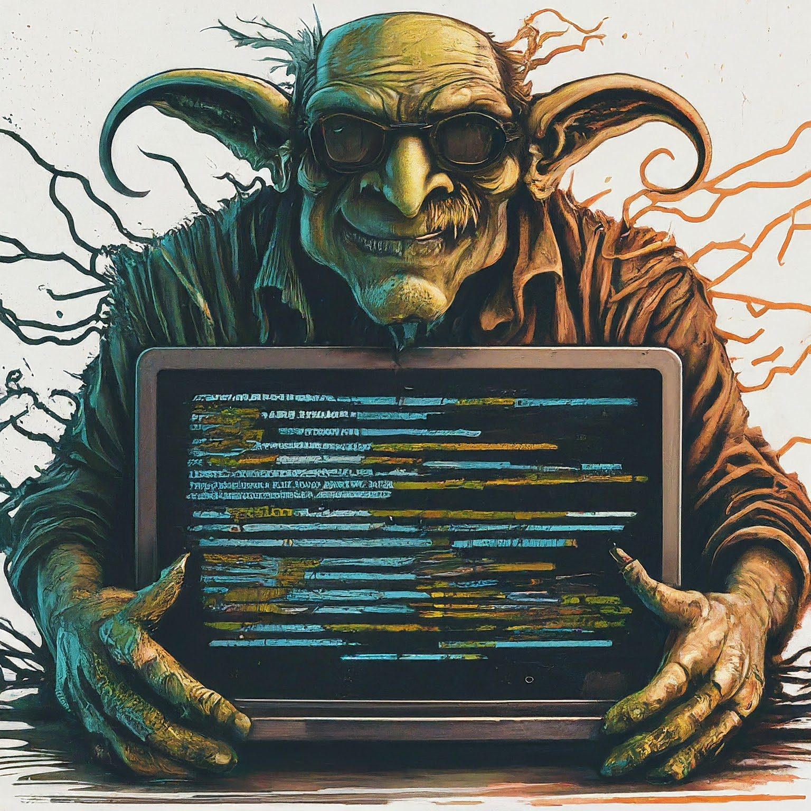

# goblin




Goblin application: Get remote access from a Telegram bot.

## Table of Contents

- [Description](#description)
- [Features](#features)
- [Installation](#installation)


## Description

Python-based remote PC access and file management tool for Windows. Download files, monitor system info, and easily navigate drives/folders.

## Features

- **Effortlessly access your Windows PC from anywhere**
- **Securely download any file type:** ZIP, RAR, movies, PDFs, and more
- **Easily navigate through your folders and drives**
- **Remotely monitor your PC's system information**
- **Built with Python for a smooth and reliable experience**


# Installation

1. **Telegram Bot:**

   - Create a Telegram bot using [BotFather](https://telegram.me/BotFather) and obtain your bot token.
   - Replace `<your_bot_token>` in the code with your actual bot token. 

2. **Libraries:**

   - Install the required Python libraries:

     ```bash
     pip install -r requirements.txt
     ```

3. **Optional (Executable):**

   - _(Optional)_ Create an executable file for easier distribution using tools like:

     * **PyInstaller:**
       ```bash
       pyinstaller --onefile <your_script_name>.py 
       ```
     * **py2exe:** (requires a `setup.py` script)
       ```bash
       python setup.py py2exe 
       ``` 


